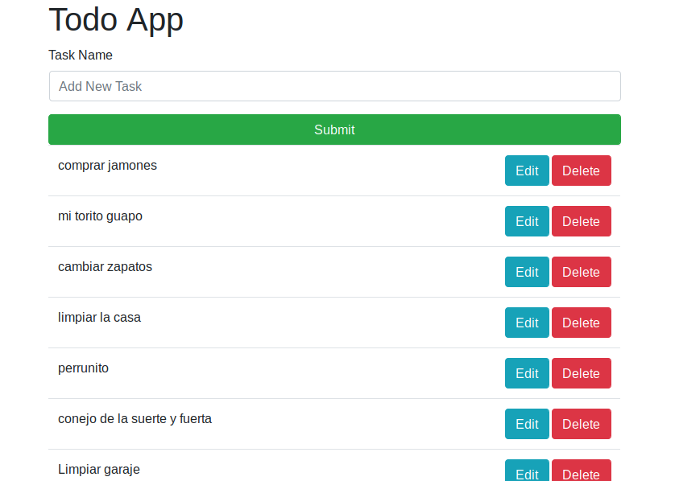

# mevn-todolist-mysql-2
CRUD CON NODEJS-VUEJS-MYSQL Y BOOTSTRAP 4.3


# FUNCIONAMIENTO:
```
*cd mevn-todolist-mysql-2
*npm install
*npm start
*cd mevn-todolist-mysql-2/client
*npm install
*npm run serve
```
